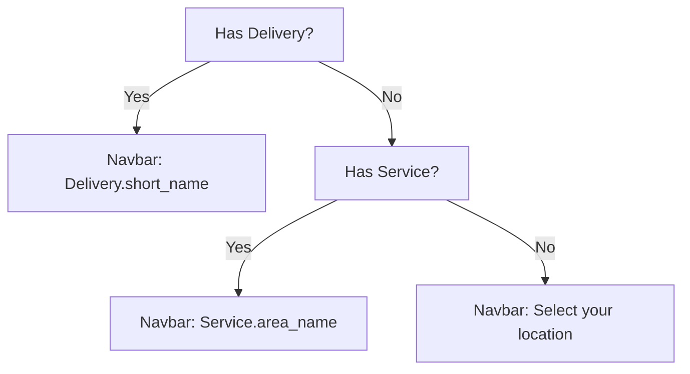
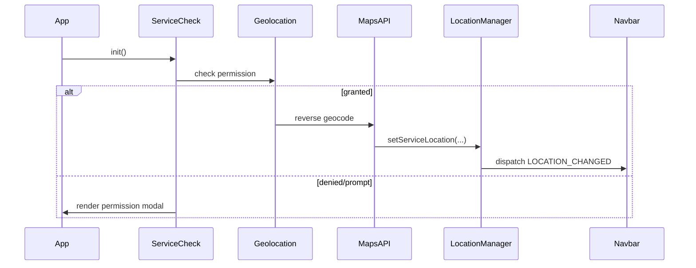
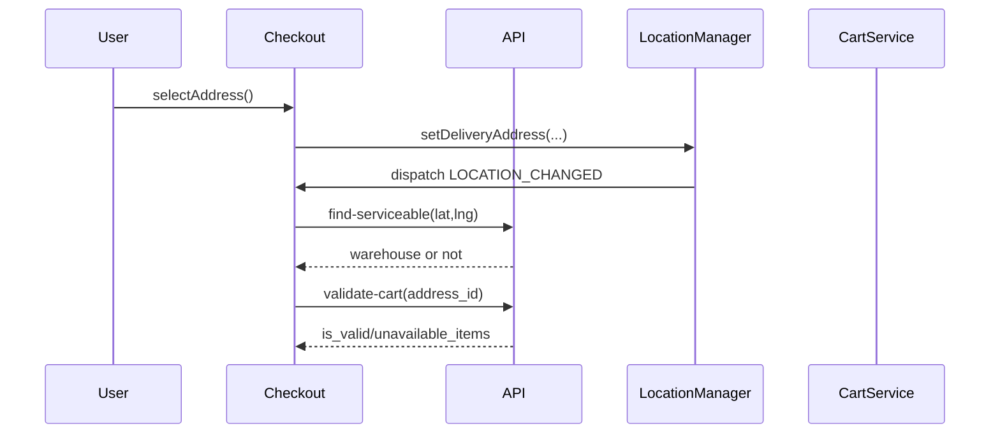
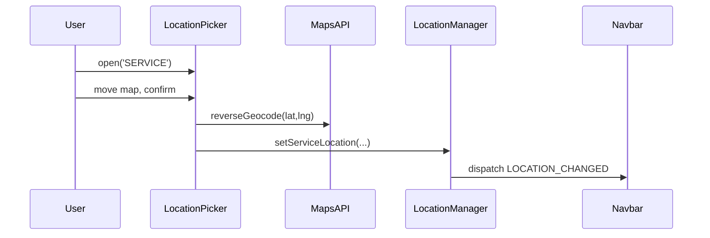

# Location System Design & Workflow

⚙️ **Purpose & Scope**

This document describes the complete Location System used by the Quick-Commerce web app (Blinkit/Swiggy style). It covers the client-side state model, UI rules, flows (first-to-last), API interactions, edge cases, testing checklist, and instrumentation guidance.

---

## 🔑 Glossary
- **L1 / Service Location (SERVICE)**: GPS/map-pin based browsing location used for store selection / stock checks.
- **L2 / Delivery Address (DELIVERY)**: User-saved address used for checkout and final routing (taxes, carts, warehouse selection).
- **Navbar Location**: Display-only UI element reflecting either L2 (preferred) or L1, or a default hint when neither exists.
- **Core Confirmation Rule**: The authoritative rule that must pass in production (see below).

---

## Core Confirmation Rule (MUST PASS)

Strict, non-negotiable rule for navbar display logic:

IF `selected_delivery_address` exists:
    navbar_location = selected_delivery_address.short_name
ELSE IF `current_service_location` exists:
    navbar_location = current_service_location.area_name
ELSE:
    navbar_location = "Select your location"

❌ No deviation. No inferred/merged logic.

---

## High-level Architecture

Components (client-side):
- `ServiceCheck` — handles permission modal, geolocation fetching, reverse geocoding, and calling `LocationManager.setServiceLocation()` on success.
- `LocationManager` — single source of truth for location contexts (L1 & L2). Persists to `localStorage` and emits `app:location-changed` events.
- `LocationPicker` — map modal used for manual service pinning and address saving flows (`SERVICE` or `ADDRESS` modes).
- `Navbar` (render) — reads `LocationManager.getDisplayLocation()` and renders label/subtext & icon states.
- `Checkout` page — loads addresses, allows selection, calls `LocationManager.setDeliveryAddress()` and `resolveWarehouse()`.
- `Cart/Checkout Services` — call backend `/orders/validate-cart/` and `/warehouse/find-serviceable/` as part of checkout.

Server-side endpoints used by the frontend flows:
- `POST /warehouse/find-serviceable/` — returns `serviceable: bool` and `warehouse` details.
- `POST /orders/validate-cart/` — validate cart items for given address.
- `POST /auth/customer/addresses/` — save user address / list addresses via `GET`.

Key Events:
- `APP_CONFIG.EVENTS.LOCATION_CHANGED` (string: `'app:location-changed'`) — used by multiple components to re-render and re-evaluate.

Storage keys (localStorage):
- `APP_CONFIG.STORAGE_KEYS.SERVICE_CONTEXT` (L1) — JSON: { lat, lng, area_name, city, formatted_address }
- `APP_CONFIG.STORAGE_KEYS.DELIVERY_CONTEXT` (L2) — JSON: { id, label, address_line, city, lat, lng }
- `APP_CONFIG.STORAGE_KEYS.WAREHOUSE_ID` — ID of resolved warehouse

---

## Data Example

L1 (service) example:

```json
{
  "lat": 12.9716,
  "lng": 77.5946,
  "area_name": "Koramangala",
  "city": "Bengaluru",
  "formatted_address": "Koramangala, Bengaluru, Karnataka, India"
}
```

L2 (delivery) example:

```json
{
  "id": 12345,
  "label": "Home",
  "address_line": "Flat 12, 4th Main",
  "city": "Bengaluru",
  "lat": 12.9,
  "lng": 77.6
}
```

---

## UI Behaviour & Rendering Rules

- The Navbar must call `LocationManager.getDisplayLocation()` for authoritative label/subtext.
- `getDisplayLocation()` implements the Core Confirmation Rule.
- Icons and classes change depending on `type` returned (DELIVERY, SERVICE, NONE).
- Navbar click opens `LocationPicker.open('SERVICE')` for manual service pin. Picker footer MUST include a lightweight "Manage addresses" affordance to navigate to address management (no redesign required).
- The Navbar modal must NOT auto-save anything; confirm actions are explicit (Confirm Location / Save Address).

---

## Flows (Detailed)

### 1) Initial App Load (happy & negative paths)

- On `DOMContentLoaded`, app loads components and calls `ServiceCheck.init()` (unless a service context already exists).
- `ServiceCheck.init()` checks `navigator.permissions.query({ name: 'geolocation' })`:
  - If `granted`: call `detectGPS(true)` (silent). On success: `ServiceCheck.handleLocationSuccess()` → `LocationManager.setServiceLocation()` → dispatch `LOCATION_CHANGED` → navbar re-renders.
  - If `prompt` or `denied`: show permission modal (`renderPermissionModal()`).
    - If user ALLOWS: proceed as `granted` flow.
    - If user DENIES or closes modal: app continues; **Navbar shows: `Select your location`**; app must not crash.

Expected Navbar text per sub-case:
- GPS allowed & geocode worked: show service area (e.g., "Koramangala") unless DELIVERY exists.
- Permission denied: "Select your location"

Note: **CALL TO ACTION** — do not remove existing L2 when setting L1.

### 2) Selecting service pin (manual picker)

- `LocationPicker.open('SERVICE')` loads map centered on stored service or default coordinates.
- User moves map and clicks Confirm → `LocationPicker.confirmPin()` calls `LocationManager.setServiceLocation()`.
- The UI closes and triggers `LOCATION_CHANGED`. **Do not clear delivery context.**

### 3) Address selection & save (checkout flow)

- `checkout.js` loads addresses and attempts to match stored L2. If matched, auto-select and call `updateContextAndResolve()`.
- Selecting an address calls `LocationManager.setDeliveryAddress()` (L2) and `resolveWarehouse()`.
- `setDeliveryAddress()` must NOT remove L1. L2 must take display priority immediately.
- `resolveWarehouse()` checks `POST /warehouse/find-serviceable/` and sets `WAREHOUSE_ID` on success.
- Order placement sequence includes `POST /orders/validate-cart/` for stock validation. If validation fails, show modal and block checkout (items not auto-cleared).

### 4) Checkout / Order completion

- On successful COD order: the checkout logic currently removes the `DELIVERY_CONTEXT` to clear selection (expected behavior); ensure UX flows post-order are consistent (redirect to `success.html`).

### 5) Address deleted / stale-storage cleanup

- When loading the addresses list, compare `localStorage` `DELIVERY_CONTEXT.id` with server addresses. If not present, **clear the stored DELIVERY_CONTEXT**, emit `LOCATION_CHANGED` and inform the user.
- This prevents the Navbar from showing a deleted or stale address.

---

## Edge Cases & Handling (VERY IMPORTANT)

1. GPS allowed → then address selected → then GPS changes
   - Expected: Delivery (L2) still displayed. Cart and checkout use L2. L1 updates should not remove L2.
   - Implementation: `setServiceLocation()` **does not** call `removeItem(DELIVERY)`.

2. GPS denied → checkout address selected
   - Expected: address persists; user can checkout normally.

3. Address deleted on server while client has it stored
   - Expected: On next addresses load, client clears stored L2 and notifies user.

4. Logout & Login
   - Logout: `ApiService.logoutAndRedirect()` performs `localStorage.clear()` — Navbar resets to default.
   - Login: hydrate user context and, if addresses exist, the previous L2 might be restored by server-driven flows.

5. Slow network / Reverse geocode fails
   - Expected: Use fallback labels (e.g., `GPS Location`, `Unknown Location`) and allow manual selection.

6. Silent GPS failure during app load
   - If `detectGPS(true)` fails, show permission modal (non-silent) to let user pick manually.

---

## APIs & Contracts used by Location Flows

- POST /warehouse/find-serviceable/
  - Request: { latitude, longitude, city }
  - Response: { serviceable: boolean, warehouse: { id, ... } }

- POST /orders/validate-cart/
  - Request: { address_id }
  - Response: { is_valid: boolean, unavailable_items: [...] }

- GET /auth/customer/addresses/
  - Response: list of user addresses

- POST /auth/customer/addresses/ (save address)

---

## Testing Checklist (QA) ✅

Follow these step-by-step tests with expected outputs (this mirrors the production audit checklist):

1. Initial App Load
   - Permission popup appears when appropriate.
   - Allow → GPS coordinates fetched → reverse geocode → Navbar shows service area (unless delivery exists).
   - Deny/Close → Navbar shows "Select your location"; browsing works.

2. Navbar Display Priority
   - Set DELIVERY → Navbar shows DELIVERY.
   - Trigger GPS update → Navbar continues to show DELIVERY.
   - Clear DELIVERY → Navbar shows SERVICE if available.
   - No location → Navbar shows exactly "Select your location".

3. Checkout & Address Selection
   - Select saved address: Navbar updates immediately to `label • area` or short formatted address.
   - Add new address via map pin → saved → Navbar updates to new L2.
   - Service location remains in storage.

4. Location Change & Store Validation
   - Changing L2 should recalc warehouse & validate cart.
   - If items unavailable, show modal, block checkout, do NOT clear cart silently.

5. Navbar Click Behavior
   - Navbar click opens picker modal (SERVICE) and contains "Manage addresses" link.
   - Picker does not auto-save without explicit user confirmation.

6. Session Restore
   - Refresh: L1 and L2 restored correctly; priority still holds; no flicker to wrong label.

7. Edge Cases (see above)

Include tests for slow network / geocode failures.

8. MapsLoader mock for Playwright (deterministic tests)

- Create `frontend/tests/mocks/maps-loader-mock.js` with a minimal deterministic mock that sets `window.MapsLoader.load()` and a lightweight `window.google.maps` API used by the app (Map, Marker, LatLng, Geocoder).

- Example mock (compact):

```javascript
// Minimal deterministic MapsLoader mock for Playwright tests
(() => {
  window.MapsLoader = {
    load: () => {
      if (!window.google) {
        window.google = {
          maps: {
            Map: class {},
            Marker: class {},
            LatLng: function(lat, lng) { this.lat = () => lat; this.lng = () => lng; },
            Geocoder: class {
              geocode(request, callback) {
                const results = [{
                  formatted_address: '123 Test Street, Testville',
                  geometry: { location: { lat: () => 12.34, lng: () => 56.78 } }
                }];
                callback(results, 'OK');
              }
            },
            event: { addListener: () => {} }
          }
        };
      }
      return Promise.resolve(window.google);
    }
  };
})();
```

- Inject it in Playwright tests with `page.addInitScript()` so it runs before app scripts. Example test setup:

```javascript
import path from 'path';

test.beforeEach(async ({ page }) => {
  const mockPath = path.join(__dirname, 'mocks', 'maps-loader-mock.js');
  await page.addInitScript({ path: mockPath });
});
```

- Keep the mock inside `frontend/tests/mocks/` and only inject it from tests to avoid affecting production code. Use `page.route()` to stub any network calls if needed for further determinism.

---

## 📊 Diagrams & Sequence Flows

Below are visual sequence flows (Mermaid) with ASCII fallbacks for environments that do not render Mermaid.

### Core Display Rule (flowchart)



ASCII fallback:

[Has Delivery?] --Yes--> [Navbar: Delivery.short_name]
[Has Delivery?] --No--> [Has Service?]
[Has Service?] --Yes--> [Navbar: Service.area_name]
[Has Service?] --No--> [Navbar: Select your location]

---

### Initial App Load (permission & GPS)



ASCII fallback:

App -> ServiceCheck: init()
ServiceCheck -> Geolocation: check permission
If granted -> Geolocation -> MapsAPI -> LocationManager.setServiceLocation -> Navbar: LOCATION_CHANGED
If denied  -> ServiceCheck -> App: render permission modal

---

### Address selection & Checkout (warehouse & validation)



ASCII fallback:

User -> Checkout: selectAddress()
Checkout -> LocationManager: setDeliveryAddress
LocationManager -> Checkout: LOCATION_CHANGED
Checkout -> API: find-serviceable(lat,lng) => warehouse
Checkout -> API: validate-cart(address_id) => is_valid/unavailable_items

---

### LocationPicker (manual pin confirm)



ASCII fallback:

User -> LocationPicker: open('SERVICE') -> move map -> confirm
LocationPicker -> MapsAPI: reverseGeocode
LocationPicker -> LocationManager.setServiceLocation
LocationManager -> Navbar: LOCATION_CHANGED

---

## Mermaid rendering notes
- GitHub, many Markdown viewers, and VS Code (with extension) render Mermaid. If your viewer doesn't, the ASCII fallback diagrams above provide the same information.

---

## Observability & Instrumentation

- Emit `window.APP_CONFIG.EVENTS.LOCATION_CHANGED` with `{ detail: { source } }` and log key sources (SERVICE, DELIVERY, ADDRESS_CLEANUP).
- Add console asserts in dev to catch regressions (`console.assert` used in `setServiceLocation()` during dev).
- Track metrics: `location.permission.granted|denied`, `location.reversegeocode.success|fail`, `address.not_found_cleanup`.

---

## Security & Privacy

- Location permission is requested using the browser geolocation API; respect user choice and do not excessively re-prompt.
- Do not persist sensitive extras beyond necessary (only store coordinates and minimal address fragments required for routing).
- On Logout: `localStorage.clear()` must remove location contexts.

---

## Regression Prevention & Tests

- Unit tests:
  - `LocationManager.setServiceLocation()` MUST NOT remove `DELIVERY_CONTEXT`: add a test asserting L2 exists after calling setServiceLocation.
  - `LocationManager.getDisplayLocation()` must return the Core Confirmation Rule outputs for permutations of contexts.
- Integration tests:
  - Simulate permission granted/denied, map pin confirmation, address save, and verify navbar text & events.
- Dev sanity check: included a small non-destructive sanity run on `localhost` to detect accidental removals.

---

## Minimal Fixes & Hardening (already applied)
- Removed unconditional `localStorage.removeItem(this.KEYS.DELIVERY)` from `setServiceLocation()`.
- Fixed default label string to **"Select your location"**.
- Added `Manage addresses` button to `LocationPicker` modal (SERVICE mode).
- Added stale-storage cleanup when addresses list does not contain stored `DELIVERY_CONTEXT`.

---

## Release Note (PR template snippet)

**Title:** Fix: preserve delivery address when service location updates; stale-address cleanup

**Changes:**
- Prevent L1 from wiping L2
- Default navbar label corrected
- Added Manage addresses button to LocationPicker
- Clear stale stored delivery on addresses load
- Add dev sanity assertion

**Test notes:** Run frontend smoke tests (`frontend/scripts/smoke-test.sh`) and perform manual QA checklist outlined in this doc.

---

## Appendix — Implementation Pointers (files)
- `frontend/assets/js/utils/location-manager.js` — single source of truth; priority logic and storage keys
- `frontend/assets/js/utils/service-check.js` — permission & GPS detection
- `frontend/assets/js/utils/location_picker.js` — map modal & pin confirmation
- `frontend/assets/js/pages/checkout.js` — address loading, selection, stale-cleanup
- `frontend/assets/js/layout/main-layout.js` — navbar rendering & click bind

---

If you'd like, I can also add basic diagrams (sequence/flow) or a short Markdown checklist with commands to run automated tests and manual test scripts.  

---

*Document created by GitHub Copilot (Raptor mini (Preview)) — Location audit & fixes implemented.*
